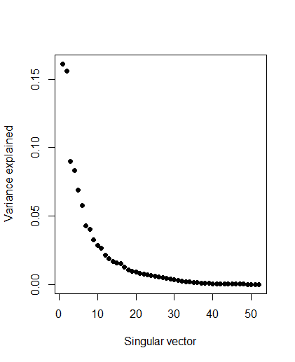
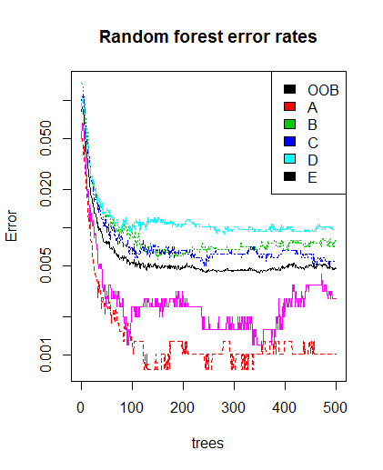
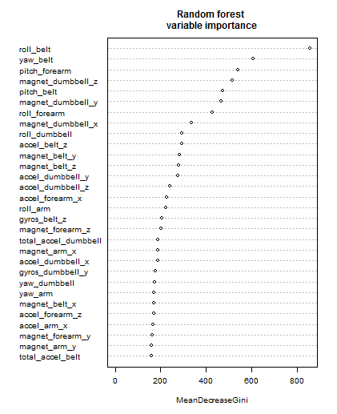
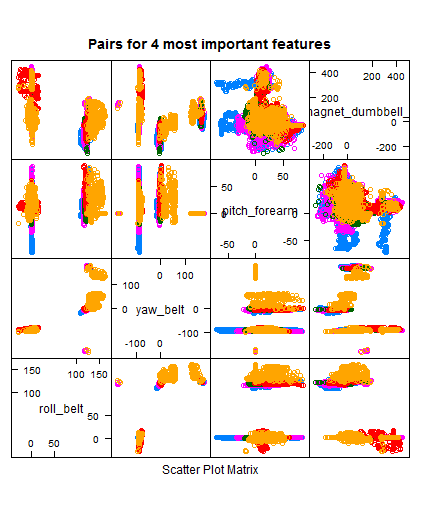

####Practical Machine Learning

# Prediction Assignment Writeup

------

### Data sets


The Data sets were loaded with read.csv() function. Both "NA" and "" (empty) strings were consider as NA.

    test_set = read.csv("pml-testing.csv")
    training_set = read.csv("pml-training.csv", na.strings = c("NA", "") )


There are lot of variables with NA or empty values. I believe the imputing will not improve fit because number of missing values is too large (more than 95%) for some variables and we have no enough data representation for such variables.
These columns were removed with following code:

    # remove columns with number of NA's more than NA_rate
    remove_NA_Columns <- function(x, NA_rate){
        NA_cols_del = data.frame(colSums(is.na(x))) / nrow(x)  > NA_rate
        x[,which(!NA_cols_del)]
    }
    
    training_set = remove_NA_Columns(training_set, 0.9)
    test_set = remove_NA_Columns(test_set, 0.9)


### Data analysis

Columns in the both data sets belongs to three types:

1. Numerous sensor's readings
2. Classification-related column:
    + **"classe"** *for training set*
    + **"problem_id"** *for test set*
3. Service columns:
    + **"X"**               *- essentially row index*
    + **"user_name"**       *- user name*
    + **"raw_timestamp_part_1"** and **"raw_timestamp_part_2"** *- row timestamp*
    + **"cvtd_timestamp"**  *- more readable form of timestamp*
    + **"new_window"** and **"num_window"** *- semantics unknown*
    

The **new_window** variable is categorical with only two levels while one level overwhelms over another (98%).

I decided to use only sensor's readings as relevant to the prediction task. Other columns were removed with following code:


    removeColumns <- function(x, columns){
        x = x[,setdiff(names(x), columns)]
    }
    
    cols_to_del = c("X", "user_name", 
                    "raw_timestamp_part_1", "raw_timestamp_part_2", 
                    "cvtd_timestamp", 
                    "new_window", 
                    "num_window")
    training_set = removeColumns(training_set, cols_to_del)
    test_set = removeColumns(test_set, cols_to_del)


------
**Variance analysis with PCA:**

    svd1 <- svd(scale(training[,-ncol(training)]))
    plot(svd1$d^2/sum(svd1$d^2), pch = 19, xlab = "Singular vector", ylab = "Variance explained")




### Training and validation sets

The remaining **training_set** was split to training and validation sets using *caret* package:

    library(caret)
    inTrain <- createDataPartition(y=training_set$classe,p=0.7, list=FALSE)
    training <- training_set[inTrain,]
    testing <- training_set[-inTrain,]
    dim(training); dim(testing)


### Fit model with Random Forest

Actually Random Forest method doesn't requre separate cross-validation or test set to get an unbiased estimate of the test set error, but I decided to use additional test set for sanity check.


    library(randomForest)
    set.seed(8484)
    # train 
    modFit <- randomForest(classe~ ., data=training)
    # Predicting new values
    pred = predict(modFit,newdata=testing)
    confusionMatrix(pred, testing$classe)

Train process with default parameters takes about 30 sec.
Model shows out-of-bag error estimation  =0.48% :

    Call:
     randomForest(formula = classe ~ ., data = training) 
                   Type of random forest: classification
                         Number of trees: 500
    No. of variables tried at each split: 7
    
            OOB estimate of  error rate: 0.48%
    Confusion matrix:
         A    B    C    D    E class.error
    A 3902    1    2    0    1 0.001024066
    B   13 2638    7    0    0 0.007524454
    C    0   10 2383    3    0 0.005425710
    D    0    0   22 2230    0 0.009769094
    E    0    1    2    4 2518 0.002772277

Printed statistics shows accuracy with testing set =0.9986 :

    Confusion Matrix and Statistics
    
    Reference
    Prediction    A    B    C    D    E
                  A 1673    0    0    0    0
                  B    1 1138    2    0    0
                  C    0    1 1024    2    0
                  D    0    0    0  960    0
                  E    0    0    0    2 1082
    
    Overall Statistics
    
    Accuracy : 0.9986
    95% CI : (0.9973, 0.9994)
    No Information Rate : 0.2845
    P-Value [Acc > NIR] : < 2.2e-16
    
    Kappa : 0.9983


The RF Error Rates:

    plot(modFit, log="y", main="Random forest error rates")
    legend("topright", colnames(modFit$err.rate),col=1:5,fill=1:5)




### Features analysis:


    # Get variable importance and sort more important first
    vimp = varImp(modFit)
    vimp_order = order(vimp, decreasing = TRUE)
    vimp_sorted = as.data.frame(vimp[vimp_order,], row.names=row.names(vimp)[vimp_order])
    names(vimp_sorted) = names(vimp)

```
> head(vimp_sorted, 10)
   row.names       Overall
roll_belt         854.6597
yaw_belt          607.1912
pitch_forearm     538.0936
magnet_dumbbell_z 516.4016
pitch_belt        473.0256
magnet_dumbbell_y 466.5814
roll_forearm      428.6566
magnet_dumbbell_x 334.5113
roll_dumbbell     293.6822
accel_belt_z      293.6580
```


    # Dotchart of variable importance as measured by a Random Forest
    varImpPlot(modFit, cex=0.6, main="Random forest \nvariable importance")




Plots for first 4 important variables show rather discriminative projections of clusters on these variables:

    featurePlot(x=testing[, vimp_order[1:4]], y=testing$classe, plot="pairs", main="Pairs for 4 most important features")





Attempt to fit model using only first 7 most important variables gives decent results: 

    OOB estimate of  error rate: 1.53%
    Accuracy : 0.9869


Prediction using both all sensor's variables and only four most important variables gives same result on testing set pml-training.csv:

    (pred_tst = predict(modFit,newdata=test_set))

    1  2  3  4  5  6  7  8  9 10 11 12 13 14 15 16 17 18 19 20
    B  A  B  A  A  E  D  B  A  A  B  C  B  A  E  E  A  B  B  B

